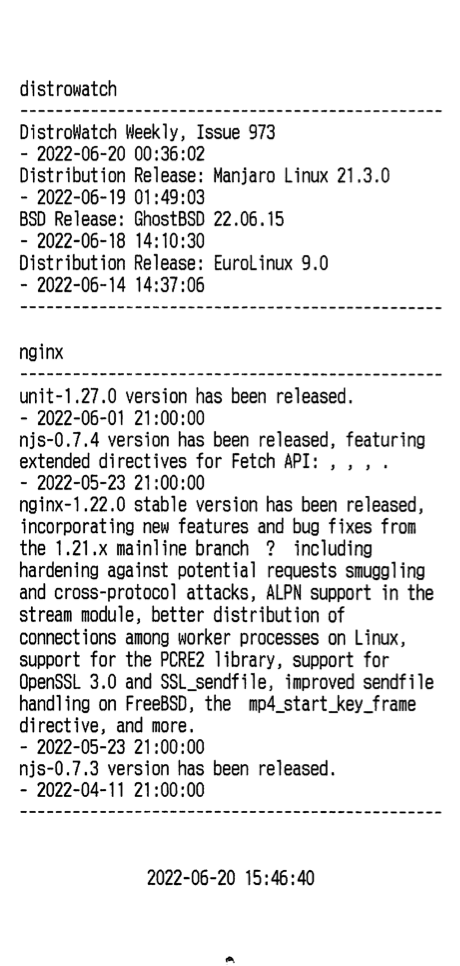

rss-receipts
============

Simple Python script that fetches RSS feeds from a configuration file and prints 
formatted output to an ESCPOS receipt printer.

### Usage
Create a config.ini. You need to identify the receipt printer's `printer_ip` in 
the DEFAULT section, and provide at least one `[section]` with an RSS feed's 
`url`:

```ini
[DEFAULT]
printer_ip = 192.168.1.2
print_date_footer = yes

[distrowatch]
url = https://distrowatch.com/news/dw.xml
print_title = yes

[nginx]
url = http://nginx.org/index.rss
print_title = yes
```

Because the code uses [feedparser](https://pypi.org/project/feedparser/), 
theoretically any supported format can be used. But only RSS 2.0 and RSS 1.0 
feeds with appropriate titles and dates have been tested.

### Example print output


### Optional settings
Global settings must go in the DEFAULT section.
Local settings can be specified in the DEFAULT section or overridden per feed.

| setting                | scope  | description                                                         | example             |
|------------------------|--------|---------------------------------------------------------------------|---------------------|
| printer_width          | global | Number of characters in one line (typically 48, 42, or 35)          | 48                  |
| print_date_footer      | global | Whether to print a date footer centered in the bottom               | `yes`               |
| limit_entries_per_feed | local  | How many entries to print out                                       | 4                   |
| date_format            | global | Format for printing date/timestamps                                 | `%Y-%m-%d %H:%M:%S` |
| print_title            | local  | Whether to print a header with the title of the feed                | `yes`               |
| title                  | local  | Custom title for the feed (otherwise the section name will be used) | `NASA RSS feed`     |

